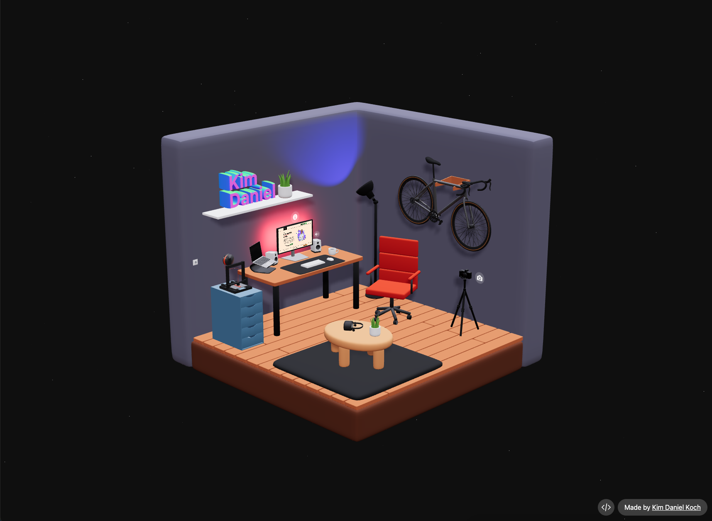

# 3D Room

This is a Three.js experiment. I resembled a 3D room filled with objects to perform my hobbies.

### Built with
- [Blender](https://www.blender.org/)
- [React](https://reactjs.org)
- [Three.js](https://threejs.org/)
- [@react-three/fiber](https://github.com/pmndrs/react-three-fiber)
- [pmndrs/drei](https://github.com/pmndrs/drei#readme)
  
All models were created by me with Blender, the Blender file is also included in this repository.

[Link](https://drei.kimdaniekoch.de)



## Setup

Make sure to install the dependencies:

```bash
# npm
npm install
```

## Development Server

Start the development server

```bash
npm run dev
```

## Production

Build the application for production:

```bash
npm run build
```

Locally preview production build:

```bash
npm run preview
```
